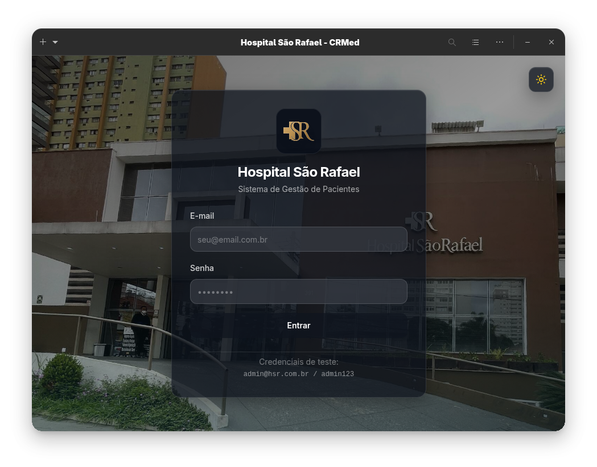

<h1 align="center">
  &nbsp;CRMed
</h1>
<p align="center">Sistema inteligente de relacionamento e performance clínica para o Hospital São Rafael.</p>
<p align="center">
  <a href="https://github.com/GrupoMoskitto/Challenge-2026/actions/workflows/ci.yml"></a>&nbsp;
  <a href="https://github.com/GrupoMoskitto/Challenge-2026"></a>&nbsp;
  <a href="https://github.com/GrupoMoskitto/Challenge-2026"></a>&nbsp;
  <a href="https://github.com/GrupoMoskitto/Challenge-2026"></a>
</p>

<br>

[](https://github.com/GrupoMoskitto/Challenge-2026)

---

### Sobre

O **CRMed** é o cérebro operacional do **Hospital São Rafael** (especializado em cirurgias eletivas e plásticas). Centraliza a jornada do paciente — da entrada do lead ao acompanhamento pós-operatório — automatizando processos que antes dependiam de múltiplas ferramentas manuais.

**Funcionalidades principais:**

- **Centralização de Leads** — Captura automática de redes sociais e canais digitais
- **Gestão de Agendas** — Controle em tempo real da disponibilidade dos cirurgiões
- **Automação WhatsApp** — Disparos automáticos para confirmações e lembretes (RN05)
- **Inteligência de Dados** — Dashboards de conversão e ociosidade médica
- **Auditoria Completa** — Rastreabilidade total de ações e alterações (RN06)

### Stack

| Camada | Tecnologia |
| --- | --- |
| **Backend** | Node.js · TypeScript · GraphQL (Apollo Server) |
| **Frontend** | React · Vite · Tailwind CSS · Radix UI · shadcn/ui |
| **Banco de Dados** | PostgreSQL · Prisma ORM |
| **Mensageria / Jobs** | Redis · BullMQ · Cron |
| **WhatsApp** | Evolution API (Baileys) |
| **Infra** | Docker · LocalStack (S3, SES) |
| **Autenticação** | JWT (jsonwebtoken · bcryptjs) |
| **Testes** | Vitest · Testing Library |

### Arquitetura

Monorepo com **pnpm workspaces** e **Turborepo**:

```
apps/
├── api/              # Backend GraphQL/REST (Apollo Server)
├── web/              # Dashboard interno (React + Vite)
├── workers/          # BullMQ Workers (RN05 — lembretes WhatsApp)

functions/
├── pdf-generator/    # Lambda — contratos e orçamentos PDF
├── lead-webhook/     # Lambda — captura de leads

packages/
├── config/           # ESLint, Prettier, TSConfig compartilhados
├── database/         # Prisma — schema, migrations, client
├── types/            # Tipos TypeScript compartilhados
├── ui/               # Biblioteca de componentes React

infra/
├── docker/           # Dockerfiles e Docker Compose
├── evolution-api-local/ # Evolution API local (QR Code WhatsApp)
└── localstack/       # Scripts de inicialização S3/SES
```

### Quick Start

```bash
# Clone
git clone https://github.com/GrupoMoskitto/Challenge-2026.git
cd Challenge-2026

# Configure
cp packages/database/.env.example packages/database/.env
cp infra/evolution-api-local/.env.example infra/evolution-api-local/.env

# Instale e inicie tudo
npm install --global pnpm
pnpm install
pnpm infra:dev
```

> [!TIP]
> O comando `pnpm infra:dev` automatiza **todo** o setup: Docker, banco de dados com seed, Evolution API (WhatsApp) e todos os apps em paralelo.

### Instalação Manual

<details>
<summary>Passo a passo</summary>

1. **Dependências:** `npm install --global pnpm && pnpm install`
2. **Docker:** `pnpm infra:up`
3. **Banco:** `pnpm --filter @crmed/database db:setup`
4. **WhatsApp:** `pnpm infra:whatsapp`
5. **Apps:** `pnpm dev`

</details>

### Scripts

| Comando | Descrição |
| --- | --- |
| `pnpm dev` | Inicia todos os projetos em modo dev |
| `pnpm build` | Build de todos os projetos |
| `pnpm infra:up` | Sobe containers Docker |
| `pnpm infra:down` | Para containers Docker |
| `pnpm infra:dev` | **Setup completo**: Docker + seed + WhatsApp + dev |
| `pnpm infra:whatsapp` | Inicia a Evolution API localmente |
| `pnpm --filter @crmed/api dev` | Inicia apenas a API |
| `pnpm --filter @crmed/web dev` | Inicia apenas o frontend |
| `pnpm --filter @crmed/workers dev` | Inicia apenas os workers |

### Portas

| Serviço | Porta |
| --- | --- |
| Web (Frontend) | `3000` |
| API GraphQL | `3001` |
| Workers | `3002` |
| PostgreSQL | `5432` |
| Redis | `6379` |
| LocalStack (AWS) | `4566` |
| Evolution API | `8080` |

### Regras de Negócio

| RN | Descrição | Prioridade |
| --- | --- | --- |
| **RN01** | **Duplicidade Zero** — Proibido cadastrar pacientes com CPF, e-mail ou telefone duplicados | Crítica |
| **RN03** | **Hierarquia** — Mudanças de status crítico exigem autorização por role | Alta |
| **RN05** | **Ciclo de Notificações** — WhatsApp: 4d, 2d, 1d antes e dia da consulta | Crítica |
| **RN06** | **Auditoria** — Toda tentativa de contato e alteração logada com data/hora/responsável | Alta |

### Variáveis de Ambiente

| Variável | Descrição |
| --- | --- |
| `DATABASE_URL` | Conexão PostgreSQL |
| `REDIS_URL` | Conexão Redis (BullMQ / State) |
| `LOCALSTACK_URL` | URL do LocalStack |
| `EVOLUTION_API_KEY` | Chave da Evolution API |
| `EVOLUTION_INSTANCE_NAME` | Instância para lembretes automáticos |
| `DEV_ALLOWED_PHONE` | **Sandbox** — Restringe mensagens a este nº em dev |

---

### API GraphQL

A API estará disponível em `http://localhost:3001/graphql` após iniciar o projeto.

<details>
<summary><strong>Queries</strong></summary>

```graphql
# Dashboard
query GetDashboardStats {
  leads { totalCount edges { node { id status origin createdAt } } }
  appointments(status: SCHEDULED) { id scheduledAt procedure patient { name } surgeon { name } }
  surgeons { id name specialty }
}

# Leads com paginação
query GetLeads($status: LeadStatus, $first: Int, $after: String) {
  leads(status: $status, first: $first, after: $after) {
    edges { node { id name email phone cpf status createdAt } cursor }
    pageInfo { hasNextPage endCursor }
    totalCount
  }
}

# Pacientes
query GetPatients {
  patients { id dateOfBirth medicalRecord lead { id name email phone cpf status } }
}

# Cirurgiões
query GetSurgeons {
  surgeons { id name specialty crm email phone isActive availability { dayOfWeek startTime endTime } }
}

# Agendamentos
query GetAppointments($status: AppointmentStatus) {
  appointments(status: $status) { id procedure scheduledAt status patient { name } surgeon { name } }
}

# Auditoria
query GetAuditLogs($entityType: String, $entityId: String) {
  auditLogs(entityType: $entityType, entityId: $entityId) { id action oldValue newValue reason createdAt user { name } }
}
```

</details>

<details>
<summary><strong>Mutations</strong></summary>

```graphql
# Leads
mutation CreateLead($input: CreateLeadInput!) { createLead(input: $input) { id name status createdAt } }
mutation UpdateLeadStatus($input: UpdateLeadStatusInput!) { updateLeadStatus(input: $input) { id status } }
mutation DeleteLead($id: ID!) { deleteLead(id: $id) { success message } }

# Pacientes
mutation CreatePatient($input: CreatePatientInput!) { createPatient(input: $input) { id dateOfBirth medicalRecord } }

# Agendamentos
mutation CreateAppointment($input: CreateAppointmentInput!) { createAppointment(input: $input) { id procedure scheduledAt status } }
mutation UpdateAppointmentStatus($input: UpdateAppointmentStatusInput!) { updateAppointmentStatus(input: $input) { id status } }

# Cirurgiões
mutation CreateSurgeon($input: CreateSurgeonInput!) { createSurgeon(input: $input) { id name specialty crm } }

# Contatos
mutation CreateContact($input: CreateContactInput!) { createContact(input: $input) { id type direction status message } }
```

</details>

<details>
<summary><strong>Enums</strong></summary>

```graphql
LeadStatus:        NEW · CONTACTED · QUALIFIED · CONVERTED · LOST
AppointmentStatus: SCHEDULED · CONFIRMED · COMPLETED · CANCELLED · NO_SHOW
UserRole:          ADMIN · SURGEON · CALL_CENTER · RECEPTION · SALES
ContactType:       WHATSAPP · CALL · EMAIL
ContactDirection:  INBOUND · OUTBOUND
ContactStatus:     READ · DELIVERED · SENT · ANSWERED · FAILED · MISSED
DocumentType:      CONTRACT · TERM · EXAM · OTHER
DocumentStatus:    PENDING · SIGNED · UPLOADED
PostOpType:        RETURN · FOLLOW_UP
PostOpStatus:      SCHEDULED · COMPLETED · CANCELLED
```

</details>

---

### WhatsApp — Evolution API

A automação de mensagens (RN05) usa a [Evolution API](https://github.com/EvolutionAPI/evolution-api) rodando **localmente** (fora do Docker) para garantir compatibilidade com a versão mais recente do Baileys.

<details>
<summary><strong>Como conectar via QR Code</strong></summary>

Se `pnpm infra:dev` está rodando, a Evolution API já está ativa.

**Via Manager UI (recomendado):**
1. Acesse `http://localhost:8080/manager`
2. Login com API Key: `***REMOVED***`
3. Crie ou selecione a instância `crmed-whatsapp`
4. Clique em **"Get QR Code"** e escaneie com o WhatsApp

**Via curl:**

```bash
# Criar instância
curl -X POST http://localhost:8080/instance/create \
  -H "apikey: ***REMOVED***" \
  -H "Content-Type: application/json" \
  -d '{"instanceName":"crmed-whatsapp","qrcode":true,"integration":"WHATSAPP-BAILEYS"}'

# Verificar conexão
curl http://localhost:8080/instance/connectionState/crmed-whatsapp \
  -H "apikey: ***REMOVED***"
```

</details>

> [!IMPORTANT]
> **Sandbox Mode:** A variável `DEV_ALLOWED_PHONE` restringe **todas** as mensagens apenas ao número definido em dev. Mensagens bloqueadas são logadas como `[DEV MODE] 🛡️ Mensagem bloqueada`.

---

### CI/CD e Testes

O pipeline GitHub Actions roda automaticamente a cada push:

- **Linting** — ESLint flat config para todo o monorepo
- **Testes** — Vitest validando RN01 (duplicidade), RN03 (hierarquia) e RN06 (auditoria)

---

### Contribuição

**Commits** — Semantic Commits:

```
feat(api): implement RN03 hierarchy constraints
fix(auth): prevent infinite redirect loop
docs: update README with CI/CD section
test(rns): add vitest unit tests
chore(eslint): setup monorepo linting
ci(github): setup CI pipeline
```

**Branches** — `MOSK-0000/tipo/tarefa-em-ingles`:

```
MOSK-0000/feat/add-login-screen
MOSK-0012/fix/dashboard-chart-tooltip
```

---

### Equipe

| Nome | GitHub | LinkedIn |
| --- | --- | --- |
| **Gabriel Couto Ribeiro** | [](https://github.com/rouri404) | [](https://www.linkedin.com/in/gabricouto/) |
| **Gabriel Kato Peres** | [](https://github.com/kato8088) | [](https://www.linkedin.com/in/gabrikato/) |
| **João Vitor de Matos** | [](https://github.com/joaomatosq) | [](https://www.linkedin.com/in/joaomatosq/) |
| **Marcelo Affonso Fonseca** | [](https://github.com/marcelo215) | [](https://www.linkedin.com/in/marcelo-affonso-fonseca-899682333/) |

---

<p align="center">
  Desenvolvido pelo <strong>Grupo Moskitto</strong> para o Challenge FIAP / Hospital São Rafael.
</p>
