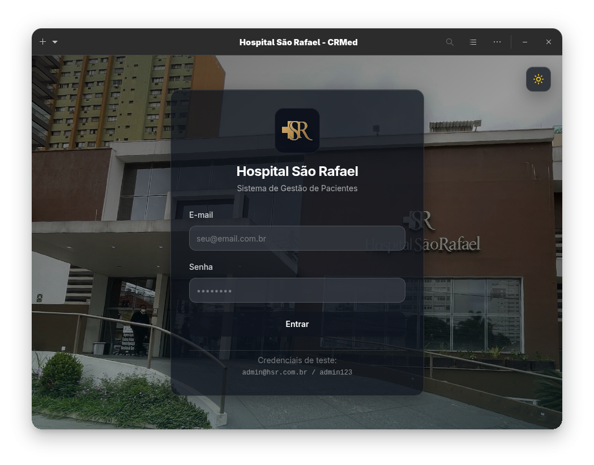
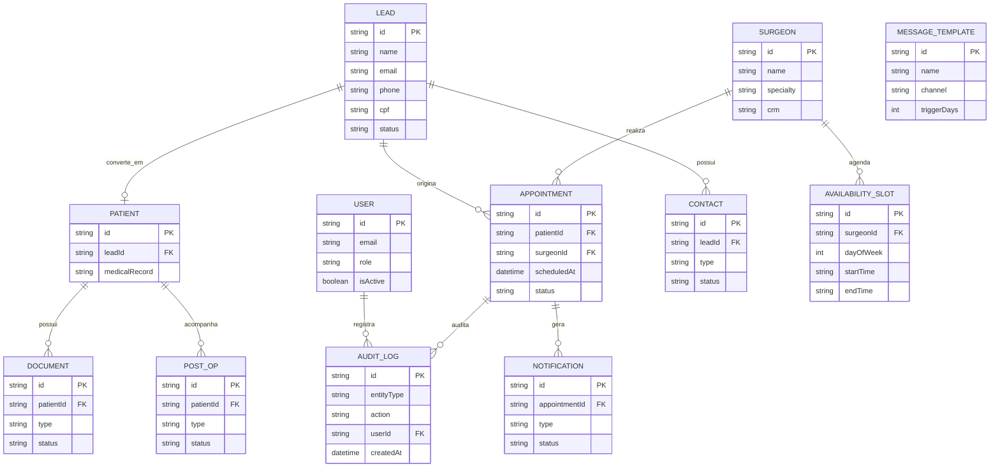

<h1 align="center">
  &nbsp;CRMed
</h1>
<p align="center">Sistema inteligente de relacionamento e performance clínica para o Hospital São Rafael.</p>
<p align="center">
  <a href="https://github.com/GrupoMoskitto/Challenge-2026/actions/workflows/ci.yml"></a>&nbsp;
  <a href="https://github.com/GrupoMoskitto/Challenge-2026"></a>&nbsp;
  <a href="https://github.com/GrupoMoskitto/Challenge-2026"></a>&nbsp;
  <a href="https://github.com/GrupoMoskitto/Challenge-2026"></a>
</p>

<br>

[](https://github.com/GrupoMoskitto/Challenge-2026)

---

### Sobre

O **CRMed** é uma plataforma integrada de inteligência clínica e gestão de jornada do paciente, desenvolvida sob medida para o **Hospital São Rafael**. O sistema atua como o sistema nervoso central da operação hospitalar, unificando desde a prospecção de leads até o acompanhamento detalhado do pós-operatório.

Através de uma arquitetura robusta e escalável, o CRMed elimina silos de informação ao conectar o setor de marketing (Leads), a equipe de atendimento (Recepção/Agenda) e o corpo clínico (Cirurgiões) em um ambiente único e seguro.

**Funcionalidades Estratégicas:**

- **Gestão 360º de Leads e Pacientes:** Fluxo contínuo de conversão, auditoria completa de alterações e ficha clínica centralizada.
- **Ecossistema de Agenda Inteligente:** Controle dinâmico de disponibilidade, gestão de profissionais de saúde e validação rigorosa de janelas de atendimento.
- **Automação de Comunicação Crítica:** Integração nativa com WhatsApp para confirmações automáticas, chatbots de autoatendimento e monitoramento proativo de SLA de resposta.
- **Segurança e Conformidade (LGPD):** Camada de proteção de dados sensíveis e controle de acesso baseado em funções (RBAC).
- **Visualização e Performance:** Dashboards analíticos de conversão e produtividade, garantindo decisões baseadas em dados reais.

### Stack

| Camada | Tecnologia |
| --- | --- |
| **Backend** | Node.js · TypeScript · GraphQL (Apollo Server) |
| **Frontend** | React · Vite · Tailwind CSS · Radix UI · shadcn/ui |
| **Banco de Dados** | PostgreSQL · Prisma ORM |
| **Mensageria / Jobs** | Redis · BullMQ · Cron |
| **WhatsApp** | Evolution Go (Golang) |
| **Infra** | Docker |
| **Autenticação** | JWT (jsonwebtoken · bcryptjs) |
| **Testes** | Vitest · Testing Library |

### Arquitetura

Monorepo com **pnpm workspaces** e **Turborepo**:

```
apps/
├── api/              # Backend GraphQL/REST (Apollo Server)
├── web/              # Dashboard interno (React + Vite)
├── workers/          # BullMQ Workers (RN05 — lembretes WhatsApp)

functions/
├── pdf-generator/    # Lambda — contratos e orçamentos PDF
├── lead-webhook/     # Lambda — captura de leads

packages/
├── config/           # ESLint, Prettier, TSConfig compartilhados
├── database/         # Prisma — schema, migrations, client
├── types/            # Tipos TypeScript compartilhados
├── ui/               # Biblioteca de componentes React

infra/
└── docker/           # Dockerfiles, Docker Compose e Evolution Go
```

### Documentação

O sistema de documentação técnica, regras de negócio e arquitetura foi construído com **VitePress** e está centralizado no diretório [`/docs`](./docs/). Ele é hospedado publicamente via **GitHub Pages** para facilitar o acesso da equipe técnica.

- [**Acessar Portal de Documentação**](https://grupomoskitto.github.io/Challenge-2026/) *(link oficial)*
- [**Rodar Localmente**](#scripts): Use o comando `pnpm --filter docs dev` para rodar a documentação no seu ambiente (porta 5174).

**Conteúdos Principais:**
- **Arquitetura** — Diagramas de serviços e fluxos de dados de ponta a ponta.
- **Banco de Dados** — Diagrama ER completo e decisões de modelagem.
- **Regras de Negócio** — Detalhamento das RN01 a RN09 e camadas de enforcement.
- **Segurança e LGPD** — Modelo RBAC, criptografia e proteção de dados sensíveis.
- **API Reference** — Referência técnica de Queries, Mutations e Enums.

### Documentação Visual

#### Diagrama ER do Banco de Dados


```mermaid
erDiagram
    USER {
        string id PK
        string email
        string role
        boolean isActive
    }

    LEAD {
        string id PK
        string name
        string email
        string phone
        string cpf
        string status
    }

    PATIENT {
        string id PK
        string leadId FK
        string medicalRecord
    }

    SURGEON {
        string id PK
        string name
        string specialty
        string crm
    }

    APPOINTMENT {
        string id PK
        string patientId FK
        string surgeonId FK
        datetime scheduledAt
        string status
    }

    CONTACT {
        string id PK
        string leadId FK
        string type
        string status
    }

    AUDIT_LOG {
        string id PK
        string entityType
        string action
        string userId FK
        datetime createdAt
    }

    NOTIFICATION {
        string id PK
        string appointmentId FK
        string type
        string status
    }

    DOCUMENT {
        string id PK
        string patientId FK
        string type
        string status
    }

    POST_OP {
        string id PK
        string patientId FK
        string type
        string status
    }

    AVAILABILITY_SLOT {
        string id PK
        string surgeonId FK
        int dayOfWeek
        string startTime
        string endTime
    }

    MESSAGE_TEMPLATE {
        string id PK
        string name
        string channel
        int triggerDays
    }

    LEAD ||--o| PATIENT : converte_em
    LEAD ||--o{ CONTACT : possui
    LEAD ||--o{ APPOINTMENT : origina
    SURGEON ||--o{ APPOINTMENT : realiza
    SURGEON ||--o{ AVAILABILITY_SLOT : agenda
    PATIENT ||--o{ DOCUMENT : possui
    PATIENT ||--o{ POST_OP : acompanha
    USER ||--o{ AUDIT_LOG : registra
    APPOINTMENT ||--o{ AUDIT_LOG : audita
    APPOINTMENT ||--o{ NOTIFICATION : gera
```
> [!NOTE]
> O diagrama resume a modelagem atual do [`schema.prisma`](packages/database/prisma/schema.prisma) e prioriza legibilidade visual.

### Quick Start

```bash
# Clone
git clone https://github.com/GrupoMoskitto/Challenge-2026.git
cd Challenge-2026

# Configure (arquivo central na raiz)
cp .env.example .env
  
# Instale e inicie tudo
npm install --global pnpm
pnpm install
pnpm infra:dev
```

<details>
<summary><strong>Instalação Manual (Passo a passo)</strong></summary>

1. **Dependências:** `npm install --global pnpm && pnpm install`
2. **Docker:** `pnpm infra:up` (PostgreSQL, Redis, Evolution API)
3. **Banco:** `pnpm --filter @crmed/database db:setup`
4. **Apps:** `pnpm dev`

</details>

> [!TIP]
> O comando `pnpm infra:dev` automatiza **todo** o setup: Docker, banco de dados com seed, Evolution API (WhatsApp) e todos os apps em paralelo. A variável `DEV_ALLOWED_PHONE` no arquivo `.env` da raiz restringe **todas** as mensagens apenas ao número definido em dev (sandbox mode).

### Scripts

| Comando | Descrição |
| --- | --- |
| `pnpm dev` | Inicia todos os projetos em modo dev |
| `pnpm build` | Build de todos os projetos |
| `pnpm infra:up` | Sobe containers Docker (PostgreSQL, Redis, Evolution Go) |
| `pnpm infra:down` | Para containers Docker |
| `pnpm infra:dev` | **Setup completo**: Docker + seed + dev |
| `pnpm --filter @crmed/api dev` | Inicia apenas a API |
| `pnpm --filter @crmed/web dev` | Inicia apenas o frontend |
| `pnpm --filter @crmed/workers dev` | Inicia apenas os workers |
| `pnpm --filter @crmed/workers seed:cron-test` | Popula 3 agendamentos fictícios nas janelas da régua |
| `pnpm --filter @crmed/workers test:cron` | Força a execução manual do Cron Diário de notificações |

### Portas

| Serviço | Porta |
| --- | --- |
| Web (Frontend) | `3000` |
| API GraphQL | `3001` |
| Workers | `3002` |
| PostgreSQL | `5432` |
| Redis | `6379` |
| Evolution Go | `8080` |

### Regras de Negócio

| RN | Descrição | Prioridade |
| --- | --- | --- |
| **RN01** | **Duplicidade Zero** — Proibido cadastrar pacientes com CPF, e-mail ou telefone duplicados | Crítica |
| **RN03** | **Hierarquia** — Mudanças de status crítico exigem autorização por role | Alta |
| **RN05** | **Ciclo de Notificações** — WhatsApp: 30d, 7d e 48h antes da consulta (inclui Pós-Op) | Crítica |
| **RN06** | **Auditoria** — Toda tentativa de contato e alteração logada com data/hora/responsável | Alta |
| **RN07** | **Segurança LGPD** — Validação de identidade (Nascimento) obrigatória para acesso a dados | Crítica |
| **RN08** | **Expediente** — Bloqueio de agendamentos fora do horário (08h-18h) com suporte a plantões extras até 23h | Alta |
| **RN09** | **SLA Crítico** — Inatividade de 24h em confirmações obrigatórias gera alertas visuais urgentes | Alta |

### Variáveis de Ambiente

O projeto utiliza um arquivo central `.env.example` na raiz do repositório. Copie-o para `.env` e preencha os valores:

| Variável | Descrição |
| --- | --- |
| `DATABASE_URL` | Conexão PostgreSQL |
| `REDIS_URL` | Conexão Redis (BullMQ / State) |
| `EVOLUTION_API_KEY` | Chave da Evolution Go |
| `EVOLUTION_API_URL` | URL da Evolution Go (padrão: `http://localhost:8080`) |
| `EVOLUTION_WEBHOOK_URL` | URL do webhook para receber mensagens do WhatsApp |
| `EVOLUTION_INSTANCE_ID` | UUID da instância primária para Workers |
| `EVOLUTION_INSTANCE_NAME` | Instância para lembretes automáticos |
| `DEV_ALLOWED_PHONE` | **Sandbox** — Restringe mensagens a este nº em dev |

> [!IMPORTANT]
> **Sandbox Mode:** O número configurado em `DEV_ALLOWED_PHONE` é usado para **todos** os testes de envio. O diálogo de "Teste de Disparo" mostra os últimos 4 dígitos do número configurado.

---

### Importação de Leads via CSV

O sistema suporta a importação em massa de leads através de arquivos CSV ou TSV (separados por vírgula, ponto-e-vírgula, tabulação ou pipe). A validação de duplicação por CPF e E-mail é rigorosa (RN01).

**Colunas Reconhecidas:**
- `Nome` (Obrigatório)
- `Telefone` (Obrigatório)
- `Email` (Opcional - Único)
- `CPF` (Opcional - Único)
- `Origem` (Opcional)
- `Procedimento` (Opcional)

<details>
<summary><strong>Exemplo de um CSV Válido</strong></summary>

```csv
Nome,Email,Telefone,CPF,Origem,Procedimento
Maria Silva,maria@email.com,11999999999,12345678901,Instagram,Rinoplastia
João Souza,,21988888888,,Indicação,
Ana Costa,ana@gmail.com,31977777777,98765432100,Google Ads,Lipo HD
Carlos Dias,carlos@teste.com,41966666666,,,
```

**Via Terminal (bash):**

```bash
# Copiar arquivo para o diretório de upload
cp leads.csv apps/api/uploads/

# Ou importar via GraphQL mutation (via Postman/curl)
curl -X POST http://localhost:3001/graphql \
  -H "Content-Type: application/json" \
  -d '{"query":"mutation { importLeads(csvContent: \"...\") { success imported errors } }"}'
```

</details>

---

### Automação de Confirmação (WhatsApp)

O CRMed utiliza uma régua de relacionamento automatizada para garantir a ocupação da agenda e reduzir o absenteísmo (No-show).

#### 1. Régua de Notificação (Gatilhos)
- **30 Dias:** Lembrete de preparativos e exames necessários.
- **7 Dias:** Check-in de orientações pré-operatórias.
- **48 Horas (Crítico):** Solicitação de confirmação obrigatória.

#### 2. Fluxo do Chatbot
Ao receber a mensagem de 48h, o paciente interage com uma máquina de estados:
- **Opção [1]:** Confirmação automática no banco (Status: `CONFIRMED`).
- **Opção [2]:** Solicitação de reagendamento (Notifica a recepção).
- **Opção [3]:** Cancelamento imediato e liberação da vaga (Status: `CANCELLED`).

#### 3. SLA de Inatividade e "Deadman Switch"
Para evitar consultas pendentes sem resposta, o sistema possui uma inteligência de monitoramento de SLA:
- **Tempo Limite:** 24 horas úteis.
- **Cálculo de Horas Úteis:** O cronômetro apenas contabiliza tempo dentro do horário de expediente (**Seg-Sex, 08:00 às 18:00**), ignorando noites e finais de semana.
- **Ação:** Se o paciente não responder em até 24h úteis, a consulta é marcada como **`ATTENTION_REQUIRED`**, sinalizando para a equipe humana intervir.

---

### WhatsApp — Evolution Go (EvoGo)

A automação de mensagens (RN05) usa o [Evolution Go](https://github.com/evolution-foundation/evolution-go) rodando via **Docker** (`evoapicloud/evolution-go:latest`). O container sobe automaticamente com `pnpm infra:up`.

<details>
<summary><strong>Como conectar via QR Code</strong></summary>

Se `pnpm infra:dev` está rodando, o Evolution Go já está ativo na porta `8080`.

**Via UI do CRMed (recomendado):**
1. Acesse o menu **Configurações > Integrações** no sistema
2. Crie uma nova instância ou clique em "Parear Dispositivo"
3. Escaneie o QR Code exibido na tela

**Via curl:**

```bash
# Criar instância
curl -X POST http://localhost:8080/instance/create \
  -H "apikey: $EVOLUTION_API_KEY" \
  -H "Content-Type: application/json" \
  -d '{"instanceName":"crmed-whatsapp","qrcode":true}'

# Verificar conexão
curl http://localhost:8080/instance/connectionState/crmed-whatsapp \
  -H "apikey: $EVOLUTION_API_KEY"
```

</details>

<details>
<summary><strong>Testando o Fluxo de Onboarding (Chatbot)</strong></summary>

Para testar como se fosse um cliente se cadastrando via WhatsApp sem enviar mensagens reais para seus contatos:
1. No arquivo `.env` da raiz, certifique-se de preencher `DEV_ALLOWED_PHONE="55[SEUDDD][SEUNUMERO]"`.
2. Certifique-se de gerar e ler o QR code no painel do Dashboard com outro aparelho (que simulará a clínica).
3. Do seu número de testes (`DEV_ALLOWED_PHONE`), envie qualquer mensagem para o número da clínica (como "Olá" ou "Quero informações").
4. O robô deve iniciar a state machine, pedindo como gostaria de ser chamado.
5. Ele pedirá a confirmação do nome via lista estruturada.
6. Oferecerá a captação opcional de E-mail (tente mandar algo errado, em seguida use "Pular", ou coloque um e-mail válido).
7. Finalize selecionando a área do procedimento; verifique no seu Dashboard (aba de Leads) que seu usuário foi perfeitamente criado!

</details>

> [!IMPORTANT]
> **Sandbox Mode:** A variável `DEV_ALLOWED_PHONE` restringe **todas** as mensagens apenas ao número definido em dev. Mensagens bloqueadas são logadas como `[INFO] [WhatsApp] Mensagem bloqueada para ...XXXX (sandbox ativo)`.

#### Webhook de Mensagens Recebidas

O sistema recebe mensagens de entrada do WhatsApp através de um webhook registrado automaticamente ao parear a instância.

- **Fluxo:** Registro via `POST /instance/connect/{name}` no EvoGo.
- **Endpoint:** `http://localhost:3002/webhook/evolution` (workers)
- **Eventos:** `MESSAGES`, `CONNECTION` e `QRCODE`.

> [!NOTE]
> **Segurança:** O webhook valida HMAC-SHA256 via header `x-webhook-signature`. Em produção, o uso de `WEBHOOK_SECRET` e IP allowlist (`WEBHOOK_ALLOWED_IPS`) é obrigatório.

#### Workers e Logger

Os workers utilizam um **logger estruturado** (`apps/workers/src/config/logger.ts`) para manter o terminal limpo e legível:

```bash
[12:30:00] [OK] [WhatsApp] Mensagem enviada para 551196325xxxx
[12:30:01] [INFO] [Worker] Processando job abc123: send-reminder
[12:30:02] [ERR] [Chatbot] Erro processando mensagem de João
```

A API do Evolution Go opera em background para que a observabilidade do fluxo fique concentrada nos logs dos workers.

---

### API GraphQL

A API estará disponível em `http://localhost:3001/graphql` após iniciar o projeto.

<details>
<summary><strong>Queries</strong></summary>

```graphql
# Dashboard
query GetDashboardStats {
  leads { totalCount edges { node { id status origin createdAt } } }
  appointments(status: SCHEDULED) { id scheduledAt procedure patient { name } surgeon { name } }
  surgeons { id name specialty }
}

# Performance Metrics
query GetPerformanceMetrics($startDate: DateTime, $endDate: DateTime) {
  performanceMetrics(startDate: $startDate, endDate: $endDate) {
    avgFirstContactTime
    avgConversionTime
    avgSchedulingTime
    responseRate
    totalContacts
    totalConversions
    leadsByDay { date count converted }
    conversionFunnel { status count }
  }
}

# Leads com paginação
query GetLeads($status: LeadStatus, $first: Int, $after: String) {
  leads(status: $status, first: $first, after: $after) {
    edges { node { id name email phone cpf status createdAt } cursor }
    pageInfo { hasNextPage endCursor }
    totalCount
  }
}

# Pacientes
query GetPatients {
  patients { id dateOfBirth medicalRecord lead { id name email phone cpf status } }
}

# Paciente com campos extendidos
mutation CreatePatient($input: CreatePatientInput!) {
  createPatient(input: $input) {
    id dateOfBirth medicalRecord
    sex weight height howMet  # Campos novos
  }
}

# Cirurgiões
query GetSurgeons {
  surgeons { id name specialty crm email phone isActive availability { dayOfWeek startTime endTime } }
}

# Agendamentos
query GetAppointments($status: AppointmentStatus) {
  appointments(status: $status) { id procedure scheduledAt status patient { name } surgeon { name } }
}

# Auditoria
query GetAuditLogs($entityType: String, $entityId: String) {
  auditLogs(entityType: $entityType, entityId: $entityId) { id action oldValue newValue reason createdAt user { name } }
}
```

</details>

<details>
<summary><strong>Mutations</strong></summary>

```graphql
# Leads
mutation CreateLead($input: CreateLeadInput!) { createLead(input: $input) { id name status createdAt } }
mutation UpdateLeadStatus($input: UpdateLeadStatusInput!) { updateLeadStatus(input: $input) { id status } }
mutation DeleteLead($id: ID!) { deleteLead(id: $id) { success message } }
mutation ExportLeads($format: String) { exportLeads(format: $format) }
mutation ImportLeads($csvContent: String!) { importLeads(csvContent: $csvContent) { success imported errors } }

# Pacientes
mutation CreatePatient($input: CreatePatientInput!) { createPatient(input: $input) { id dateOfBirth medicalRecord } }

# Notificações
mutation MarkNotificationAsRead($id: ID!) { markNotificationAsRead(id: $id) { id status } }
mutation MarkAllNotificationsAsRead { markAllNotificationsAsRead }

# Evolution API — Gerenciamento de Instâncias
mutation CreateEvolutionInstance($name: String!) { createEvolutionInstance(name: $name) { connected instanceName state } }
mutation DeleteEvolutionInstance($name: String!) { deleteEvolutionInstance(name: $name) }
mutation ConnectEvolutionInstance($name: String!) { connectEvolutionInstance(name: $name) { qrCode pairingCode connected } }

# Agendamentos
mutation CreateAppointment($input: CreateAppointmentInput!) { createAppointment(input: $input) { id procedure scheduledAt status } }
mutation UpdateAppointmentStatus($input: UpdateAppointmentStatusInput!) { updateAppointmentStatus(input: $input) { id status } }

# Cirurgiões
mutation CreateSurgeon($input: CreateSurgeonInput!) { createSurgeon(input: $input) { id name specialty crm } }

# Contatos
mutation CreateContact($input: CreateContactInput!) { createContact(input: $input) { id type direction status message } }
```

</details>

<details>
<summary><strong>Enums</strong></summary>

```graphql
LeadStatus:        NEW · CONTACTED · QUALIFIED · CONVERTED · LOST
AppointmentStatus: SCHEDULED · CONFIRMED · COMPLETED · CANCELLED · NO_SHOW
UserRole:          ADMIN · SURGEON · CALL_CENTER · RECEPTION · SALES
ContactType:       WHATSAPP · CALL · EMAIL
ContactDirection:  INBOUND · OUTBOUND
ContactStatus:     READ · DELIVERED · SENT · ANSWERED · FAILED · MISSED
DocumentType:      CONTRACT · TERM · EXAM · OTHER
DocumentStatus:    PENDING · SIGNED · UPLOADED
PostOpType:        RETURN · FOLLOW_UP
PostOpStatus:      SCHEDULED · COMPLETED · CANCELLED
```

</details>

---

### Checklist de Produção (Deploy)

Para subir o sistema em produção com total segurança (evitando vazamentos e instabilidades), garanta os seguintes itens na sua infraestrutura cloud (ex: AWS):

1. **HTTPS Obrigatório (SSL/TLS)**
   Os cookies de sessão de segurança (`access_token` e `refresh_token`) possuem a flag `Secure: true`. Portanto, eles **só funcionarão em ambientes com HTTPS**. Configure um Load Balancer (ALB) ou CloudFront com certificado ACM para habilitar a comunicação criptografada.
2. **AWS WAF (Web Application Firewall)**
   Recomenda-se acoplar o AWS WAF ao seu Load Balancer com regras (Core Rule Set) para barrar SQLi, XSS, e atuar contra DDoS e Botnets antes de atingir os containers Node.js.
3. **Criptografia de Banco (KMS)**
   Como um sistema hospitalar lida com dados confidenciais regidos pela LGPD (como dados de paciente e prontuário), garanta que a instância do banco de dados (ex: RDS PostgreSQL) possua criptografia de disco ativa.
4. **Observabilidade (Tracing e Métricas)**
   Sistemas de saúde exigem auditoria rigorosa de performance e falhas. Adicione ferramentas de **Distributed Tracing (OpenTelemetry)** e monitoramento de infraestrutura (como **Prometheus + Grafana** ou Datadog) para rastrear todas as requisições que transitam entre a API, Workers e banco de dados.
5. **Política Least Privilege (IAM)**
   As políticas para Lambdas e ECS Workers foram desenhadas em `infra/iam-policies.md`. Forneça apenas as permissões de gravação/leitura de S3 nos diretórios necessários e acesso à VPC para o RDS, não aplique papéis genéricos.
6. **Secrets Manager**
   As variáveis como `DATABASE_URL`, `JWT_SECRET`, `REFRESH_SECRET`, `WEBHOOK_SECRET` e `EVOLUTION_API_KEY` não devem ficar hardcoded no servidor. Use um gestor de segredos integrado aos seus containers de produção (como o AWS Secrets Manager).

---

### CI/CD e Testes

O pipeline GitHub Actions roda automaticamente a cada push:

- **Linting** — ESLint flat config para todo o monorepo
- **Testes Unitários/Integração** — Vitest validando RN01 (duplicidade), RN03 (hierarquia) e RN06 (auditoria)
- **Coverage Report** — Geração de relatórios de cobertura do código durante o build do CI para garantir segurança das regras de negócio

---

### Gestão do Projeto

Todas as regras de negócio, solicitações de features e correções de bugs deste MVP são rastreadas de forma transparente e colaborativa através do **GitHub Issues** e **Projects**. Nenhuma modificação sobe para a branch `main` sem estar vinculada a uma Issue devidamente documentada.

---

### AGENTS.md

O projeto inclui um [`AGENTS.md`](AGENTS.md) — arquivo de instruções para **agentes de IA** (GitHub Copilot, Cursor, Gemini CLI). Ele contém o contexto completo do projeto, regras de negócio, padrões de código e diretrizes de segurança. Agentes compatíveis o detectam automaticamente na raiz do repositório.

---

### Contribuição

Veja o guia completo em [`CONTRIBUTING.md`](CONTRIBUTING.md) — branches, commits, testes e checklist de PR.

---

### Equipe

| Nome | GitHub | LinkedIn |
| --- | --- | --- |
| **Gabriel Couto Ribeiro** | [](https://github.com/rouri404) | [](https://www.linkedin.com/in/gabricouto/) |
| **Gabriel Kato Peres** | [](https://github.com/kato8088) | [](https://www.linkedin.com/in/gabrikato/) |
| **João Vitor de Matos** | [](https://github.com/joaomatosq) | [](https://www.linkedin.com/in/joaomatosq/) |
| **Marcelo Affonso Fonseca** | [](https://github.com/marcelo215) | [](https://www.linkedin.com/in/marcelo-affonso-fonseca-899682333/) |

---

<p align="center">
  Desenvolvido pelo <strong>Grupo Moskitto</strong> para o Challenge FIAP / Hospital São Rafael.
</p>
