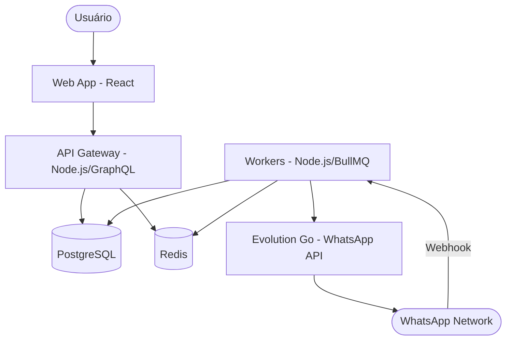

# Arquitetura do Sistema

O CRMed utiliza uma arquitetura baseada em microsserviços dentro de um monorepo, utilizando **Turborepo** para gerenciamento de dependências e builds.

## Diagrama de Serviços

## Apps e Packages

| Nome | Tipo | Responsabilidade |
| :--- | :--- | :--- |
| `apps/api` | App | Servidor GraphQL principal, lógica de negócio e autenticação. |
| `apps/web` | App | Interface do usuário em React com Tailwind CSS. |
| `apps/workers` | App | Processamento de filas (WhatsApp), Webhooks e Cron Jobs. |
| `packages/database` | Package | Schema Prisma, Migrations e Cliente de banco de dados. |
| `packages/types` | Package | Interfaces TypeScript compartilhadas entre todos os apps. |
| `packages/ui` | Package | Componentes React compartilhados (Design System). |
| `packages/config` | Package | Configurações compartilhadas (ESLint, etc). |

## Fluxo de Dados End-to-End

1. **Lead**: Um novo lead é criado via importação CSV ou Mutation GraphQL na `API`.
2. **Paciente**: Após qualificação, o lead é convertido em `Paciente`. Os dados sensíveis são protegidos conforme RN07.
3. **Agendamento**: Um `Appointment` é criado para o paciente vinculado a um `Surgeon`.
4. **Notificação**: O sistema cria notificações pendentes. O `Daily Cron` nos `Workers` identifica agendamentos próximos e adiciona jobs à fila do Redis.
5. **WhatsApp**: O `Worker` processa a fila, consome a `Evolution Go API` para enviar a mensagem e registra o status no banco de dados.
6. **Risco**: Eventos de confirmação ou inatividade disparam o recálculo do **No-Show Risk Score**.
