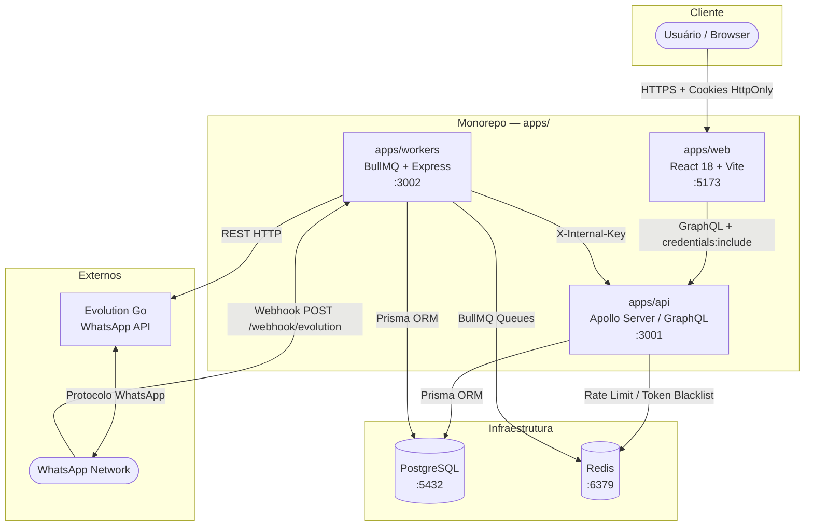
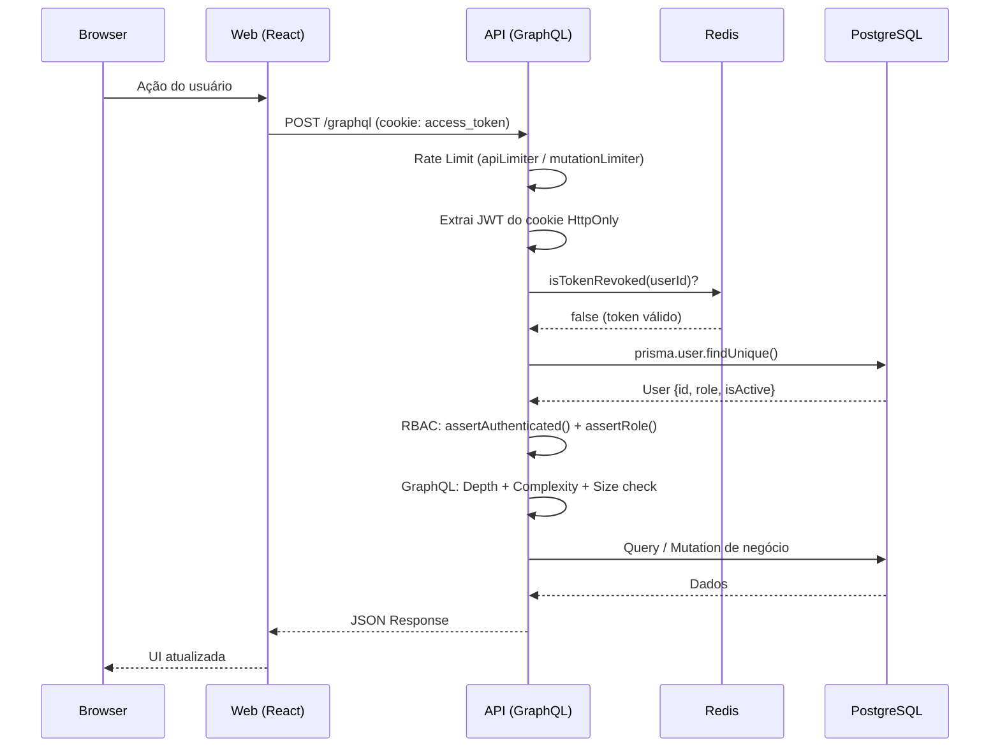
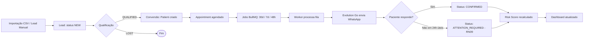

# Arquitetura do Sistema

O CRMed utiliza uma arquitetura orientada a serviços dentro de um **monorepo Turborepo**, com separação clara de responsabilidades entre API, Workers e Frontend.

## Visão Geral dos Serviços



## Apps e Packages (Monorepo)

O projeto é organizado usando **Turborepo** para gerenciar múltiplos pacotes e aplicações em um único repositório:

<div class="file-tree">
  <details open>
    <summary>apps</summary>
    <div class="folder-content">
      <details>
        <summary>api <span class="comment">Servidor GraphQL, lógica de negócio, autenticação e RBAC (Porta 3001)</span></summary>
        <div class="folder-content">
          <div class="file">package.json</div>
          <div class="file">src/index.ts</div>
        </div>
      </details>
      <details>
        <summary>web <span class="comment">Dashboard interno em React 18 com Tailwind CSS e Radix UI (Porta 5173)</span></summary>
        <div class="folder-content">
          <div class="file">package.json</div>
          <div class="file">src/App.tsx</div>
        </div>
      </details>
      <details>
        <summary>workers <span class="comment">Filas BullMQ (WhatsApp), Cron Jobs e Webhooks (Porta 3002)</span></summary>
        <div class="folder-content">
          <div class="file">package.json</div>
          <div class="file">src/index.ts</div>
        </div>
      </details>
    </div>
  </details>
  <details open>
    <summary>packages</summary>
    <div class="folder-content">
      <details>
        <summary>config <span class="comment">Configurações compartilhadas (ESLint, Prettier, TSConfig)</span></summary>
      </details>
      <details>
        <summary>database <span class="comment">Schema Prisma, Migrations, Cliente</span></summary>
        <div class="folder-content">
          <div class="file">prisma/schema.prisma</div>
        </div>
      </details>
      <details>
        <summary>types <span class="comment">Interfaces TypeScript compartilhadas</span></summary>
      </details>
      <details>
        <summary>ui <span class="comment">Design System (Componentes React compartilhados)</span></summary>
      </details>
    </div>
  </details>
  <div class="file">turbo.json</div>
  <div class="file">pnpm-workspace.yaml</div>
  <div class="file">package.json</div>
</div>

## Ciclo de Vida de uma Requisição (Request Lifecycle)



## Comunicação Interna (Workers → API)

Os Workers precisam realizar operações no banco de dados (como atualizar status de agendamentos) que passam pelos resolvers da API. Para isso, usam uma chave de autenticação interna:

```
Workers → POST /graphql
  Header: x-internal-key: <INTERNAL_API_KEY>

API Context:
  if (internalKey === validInternalKey) {
    user = { userId: 'system', role: 'ADMIN' }
  }
```

Isso garante que o fluxo de auditoria e regras de negócio da API sejam sempre respeitados, mesmo para operações automatizadas.

## Fluxo de Dados End-to-End



## Infraestrutura de Filas (BullMQ + Redis)

O Redis atua em dois papéis distintos no sistema:

| Papel | Descrição |
| :--- | :--- |
| **Filas BullMQ** | Jobs de envio de WhatsApp (reminders 30d/7d/48h, pós-op) |
| **Token Blacklist** | Revogação imediata de sessões via `token_blacklist:{userId}` |
| **Rate Limit Store** | Persistência distribuída dos contadores de Rate Limiting |

## Decisões Arquiteturais

| # | Decisão | Motivo |
| :--- | :--- | :--- |
| 1 | **Monorepo com Turborepo** | Compartilhamento de tipos, schemas e componentes sem duplicação. Build incremental via cache. |
| 2 | **GraphQL (Apollo Server)** | API flexível e auto-documentada. Permite que o frontend peça exatamente os campos necessários (data minimization — LGPD). |
| 3 | **Prisma ORM** | Migrações versionadas, type-safety total no acesso ao banco e proteção contra SQL Injection nativa. |
| 4 | **BullMQ sobre Redis** | Filas persistentes com retry automático, prioridade e dead-letter queue para notificações críticas. |
| 5 | **Soft Delete + Audit Log** | Conformidade com LGPD (rastreabilidade e direito à recuperação de dados). |
| 6 | **Cookies HttpOnly** | Tokens JWT nunca acessíveis via JavaScript — proteção contra XSS por design. |
