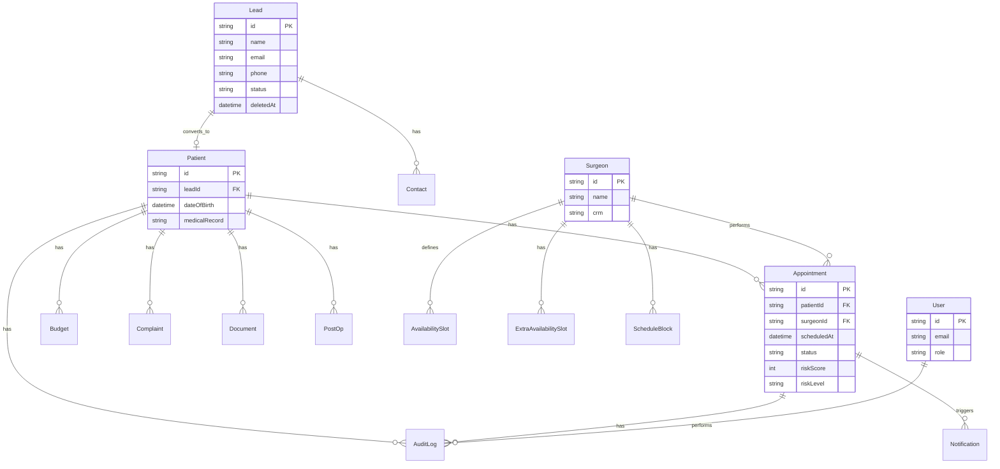

# Banco de Dados

O CRMed utiliza **PostgreSQL** como banco de dados relacional primário, gerenciado através do **Prisma ORM**.

## Diagrama ER

## Entidades Críticas

### Appointment (Agendamento)
Entidade central para a operação da clínica. Armazena o estado do atendimento e o **No-Show Risk Score**.
- `riskScore`: Valor de 0 a 100 indicando probabilidade de comparecimento.
- `riskLevel`: Classificação (LOW, MEDIUM, HIGH).

### Lead
Armazena potenciais pacientes. O campo `status` segue o fluxo `NEW` → `CONTACTED` → `QUALIFIED` → `CONVERTED`.

### AuditLog
Implementa a **RN06**, registrando cada alteração crítica no sistema, incluindo quem alterou, o valor antigo e o novo valor.

## Decisões de Modelagem

1. **Soft Delete**: Utilizado em `Lead` e `Patient` para manter integridade histórica e cumprir requisitos de LGPD (recuperação de dados).
2. **Enums**: Todos os estados (Status, Roles, Tipos) são definidos via Enums no Prisma para garantir consistência em nível de banco de dados.
3. **Indexação**: Índices adicionados em campos de busca frequente (`cpf`, `email`, `status`, `scheduledAt`) para otimizar performance.
