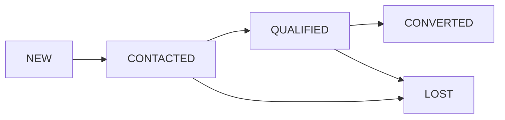

# Gestão de Leads

O gerenciamento de Leads é o ponto de entrada de novos negócios no CRMed.

## Ciclo de Vida do Lead

- **NEW**: Lead recém criado ou importado.
- **CONTACTED**: Equipe de vendas realizou o primeiro contato (WhatsApp, Call).
- **QUALIFIED**: Lead demonstrou interesse real e possui perfil para os procedimentos.
- **CONVERTED**: Lead agendou a primeira consulta e foi transformado em `Paciente`.
- **LOST**: Lead desistiu ou não respondeu após múltiplas tentativas.

## Importação via CSV

O sistema permite a importação em lote de Leads através de arquivos CSV.
- **Colunas Obrigatórias**: `name`, `email`, `phone`, `cpf`, `source`.
- **Validações**: CPFs inválidos ou e-mails mal formatados geram erro no relatório de importação.
- **Duplicatas (RN01)**: Se um CPF já existe no sistema, o registro é ignorado para preservar a integridade do lead original.

## GraphQL API

As principais operações de Leads são:
- `leads`: Query para listagem com filtros de status e busca textual.
- `createLead`: Mutation para criação manual.
- `updateLeadStatus`: Mutation para avançar o lead no funil.
- `convertLeadToPatient`: Mutation que cria a entidade `Patient` vinculada ao `Lead` (respeitando a **RN02**).
