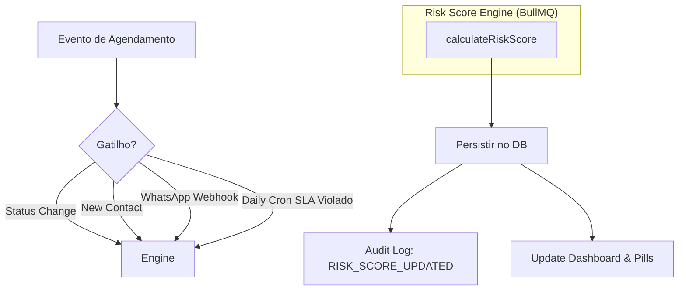

# No-Show Risk Score

O No-Show Risk Score é uma funcionalidade inteligente que prediz a probabilidade de um paciente não comparecer a um agendamento, permitindo intervenções proativas.

## Metodologia de Cálculo

O score é calculado por agendamento e varia de **0 a 100**.

### Sinais e Pesos

| Sinal | Tipo | Delta | Condição |
| :--- | :--- | :--- | :--- |
| **Confirmação 48h Ignorada** | Negativo | -40 | Status `ATTENTION_REQUIRED` |
| **Fora do Expediente** | Negativo | -20 | Agendado fora de 08h-18h |
| **Cancelamentos Prévios** | Negativo | -25 | Por ocorrência, máximo -50 |
| **SLA Violado** | Negativo | -30 | > 24h úteis sem resposta |
| **Lead não Qualificado** | Negativo | -15 | Status `NEW` ou `CONTACTED` |
| **Confirmado via Chatbot** | Positivo | +40 | Status `CONFIRMED` |
| **Comparecimentos Prévios** | Positivo | +25 | Por ocorrência, máximo +50 |
| **Lead Convertido** | Positivo | +15 | Status `CONVERTED` |
| **Horário Prime** | Positivo | +10 | Seg-Sex, 09h-17h |
| **Antecedência > 7 dias** | Positivo | +10 | Data da criação vs agendamento |
| **Contato Outbound Recente** | Positivo | +10 | Registrado na última semana |

## Thresholds de Risco

Aqui está a representação exata de como os scores são apresentados aos usuários do sistema:

- <RiskBadge :score="45" level="HIGH" label="Crítico" /> **Risco Alto:** Score < 50. Destacado em <Badge type="danger" text="Vermelho" /> no sistema. Requer intervenção urgente (ligação manual e avaliação do cirurgião).
- <RiskBadge :score="65" level="MEDIUM" label="Moderado" /> **Risco Moderado:** Score 50-79. Destacado em <Badge type="warning" text="Laranja" />. Monitorar resposta do chatbot.
- <RiskBadge :score="92" level="LOW" label="Excelente" /> **Risco Baixo:** Score >= 80. Destacado em <Badge type="tip" text="Verde" />. Procedimento segue o fluxo automatizado normal.

### Exemplo de Visualização (Simulação)

No **Dashboard**, o score é exibido assim na listagem de consultas:

> **João Silva** - Rinoplastia  
> 08:00 - Quarta-feira  
> <RiskBadge :score="35" level="HIGH" /> <Badge type="danger" text="Atenção" />

> **Maria Souza** - Mamoplastia  
> 10:00 - Quarta-feira  
> <RiskBadge :score="88" level="LOW" /> <Badge type="tip" text="Confirmado" />

## Arquitetura de Recálculo

## Visualização na UI

- **RiskPill**: Exibição inline em tabelas e cards com cores semafóricas (Teal/Amber/Red).
- **Dashboard Section**: Visão consolidada dos agendamentos críticos dos próximos 7 dias e score médio do hospital.
