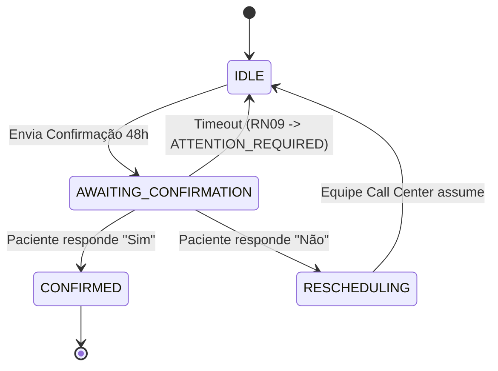

# Automação de WhatsApp

A automação de comunicações via WhatsApp é um dos pilares de eficiência do CRMed, reduzindo o no-show e automatizando o acompanhamento pós-operatório.

## Régua de Notificações

| Evento | Gatilho | Objetivo |
| :--- | :--- | :--- |
| **Lembrete 30d** | 30 dias antes do agendamento | Manter o agendamento no radar do paciente. |
| **Lembrete 7d** | 7 dias antes do agendamento | Iniciar preparativos. |
| **Confirmação 48h** | 48 horas antes do agendamento | Confirmar presença ou solicitar remarcação. |
| **Pós-Op** | Data definida no Post-Op | Acompanhamento de recuperação. |

## Máquina de Estados do Chatbot

## Integração Técnica

### Webhook e Segurança
O sistema recebe eventos da Evolution API via webhook nos `Workers`.
- **Validação**: Todas as requisições são validadas usando HMAC-SHA256 para garantir que a origem é confiável.
- **Payload**: O worker processa mensagens de texto e atualiza o status do agendamento (`CONFIRMED`, `CANCELLED`, etc) em tempo real.

### Sandbox Mode
Em ambiente de desenvolvimento e staging, as mensagens são bloqueadas para evitar spam em números reais.
- **Variável**: `DEV_ALLOWED_PHONE`
- **Comportamento**: O `WhatsappSender` verifica se o número de destino é igual ao `DEV_ALLOWED_PHONE` ou se possui um sufixo de teste configurado. Caso contrário, a mensagem é logada como `blocked_by_dev_sandbox`.
