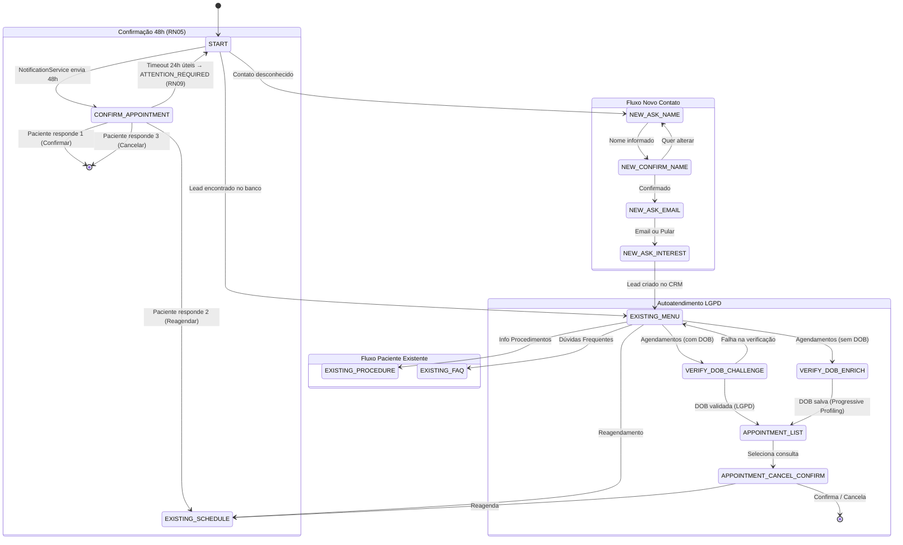
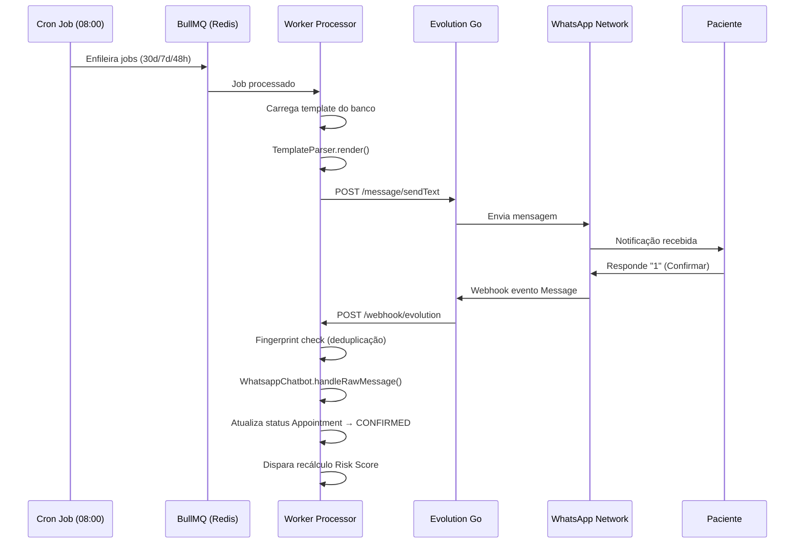

# Automação de WhatsApp

A automação de comunicações via WhatsApp é um dos pilares de eficiência do CRMed, reduzindo o no-show e automatizando o acompanhamento pós-operatório. A infraestrutura utiliza exclusivamente a **Evolution Go API** (versão Golang do Evolution API).

## Régua de Notificações (RN05)

| Evento | Gatilho | Objetivo |
| :--- | :--- | :--- |
| **Lembrete 30d** | 30 dias antes do agendamento | Manter o agendamento no radar do paciente. |
| **Lembrete 7d** | 7 dias antes do agendamento | Iniciar preparativos para o procedimento. |
| **Confirmação 48h** | 48 horas antes do agendamento | Confirmar presença ou solicitar remarcação. |
| **Reagendamento** | Alteração de data/hora no CRM | Informar ativamente o paciente sobre o novo horário. |
| **Pós-Op** | Data definida no registro de Post-Op | Acompanhamento de recuperação do paciente. |

Os envios são avaliados pelo **Cronjob Diário** (que roda às 08:00 AM - America/Sao_Paulo). O cronjob identifica os agendamentos elegíveis e enfileira as mensagens no **BullMQ (Redis)**.

### Testando a Régua de Notificações Manualmente

Para facilitar a validação em ambiente de desenvolvimento, o sistema possui scripts oficiais para gerar dados de teste e forçar a execução do cronjob:

```bash
# 1. Popula o banco com 3 agendamentos fictícios (30d, 7d, 2d) vinculados ao número do DEV_ALLOWED_PHONE
pnpm -F @crmed/workers seed:cron-test

# 2. Executa a varredura do Cronjob manualmente
pnpm -F @crmed/workers test:cron
```

O Cronjob possui observabilidade detalhada e logará no terminal exatamente quantos agendamentos foram avaliados, quantos foram enfileirados para envio e quantos foram ignorados (por já possuírem a notificação no banco de dados, evitando duplicidade).

---

## Máquina de Estados do Chatbot



### Estados do Chatbot

| Estado | Descrição |
| :--- | :--- |
| `START` | Estado inicial: identifica se o contato é novo ou existente no banco. |
| `NEW_ASK_NAME` | Captação de leads: solicita nome ao contato desconhecido. |
| `NEW_CONFIRM_NAME` | Confirmação do nome informado antes de prosseguir. |
| `NEW_ASK_EMAIL` | Captação de leads: solicita email (opcional, pode pular). |
| `NEW_ASK_INTEREST` | Triagem: lista áreas de interesse para direcionar o lead. |
| `EXISTING_MENU` | Menu principal para pacientes/leads já cadastrados. |
| `EXISTING_FAQ` | Exibe FAQ do Hospital (aguardando `0` para voltar ao menu). |
| `EXISTING_PROCEDURE` | Informações sobre procedimentos (aguardando `0`). |
| `EXISTING_SCHEDULE` | Handover para equipe humana (reagendamento/agendamento). |
| `VERIFY_DOB_CHALLENGE` | Desafio LGPD: valida data de nascimento antes de exibir dados clínicos. |
| `VERIFY_DOB_ENRICH` | Progressive Profiling: captura DOB ausente no perfil do paciente. |
| `CONFIRM_APPOINTMENT` | Aguardando resposta à confirmação de 48h (disparado pelo `NotificationService`). |
| `APPOINTMENT_LIST` | Autoatendimento: lista agendamentos futuros do paciente. |
| `APPOINTMENT_CANCEL_CONFIRM` | Gestão de agendamento selecionado (confirmar/reagendar/cancelar). |

---

## Sistema de Templates

O conteúdo das mensagens é gerenciado **exclusivamente pelo banco de dados** — nunca hardcoded no backend. Isso permite que a equipe clínica edite mensagens sem deploys.

### TemplateParser

O `TemplateParser` do pacote `@crmed/database` realiza a interpolação de variáveis:

```typescript
// Exemplo de template no banco:
"Olá *{{paciente}}*! Seu procedimento *{{procedimento}}* com o Dr. {{medico}} está agendado para {{data}}."

// Resultado após parse:
"Olá *João Silva*! Seu procedimento *Rinoplastia* com o Dr. Carlos está agendado para 20/06/2026."
```

- Suporta sintaxe `{{ }}` (duplas chaves).
- Suporta formatação nativa do WhatsApp: `*negrito*`, `_itálico_`.
- **Graceful Degradation**: Tags não encontradas são substituídas por termos genéricos (ex: `"nosso especialista"`), evitando mensagens quebradas.

---

## Integração Técnica

### Arquitetura do Fluxo de Mensagem



### Deduplicação de Mensagens (Fingerprint)

O webhook processa eventos com uma verificação de `fingerprint` em memória (`Set<string>`) com lock natural de 10 segundos, prevenindo que a mesma mensagem seja processada duas vezes em caso de retentativas da Evolution Go.

### Autenticação com Evolution Go

- **Global Key**: Header `apikey` com a chave global da instância.
- **Instance Token**: Header `Authorization: Bearer <instanceToken>` para operações instance-scoped.
- Respostas são envelopadas no formato `{ data: T, message: string }` e desembrulhadas via `EvoGoClient.unwrap()`.

---

## Sandbox Mode (Desenvolvimento)

Em ambiente de desenvolvimento e staging, as mensagens são bloqueadas para evitar spam em números reais.

- **Variável**: `DEV_ALLOWED_PHONE` (definida no `.env` raiz).
- **Comportamento**: O `WhatsappSender` verifica se o número de destino é igual ao `DEV_ALLOWED_PHONE`. Caso contrário, a mensagem é logada como `blocked_by_dev_sandbox` e **não enviada**.
- **Garantia**: Em produção, esta variável deve estar vazia ou não definida.

---

## Segurança do Webhook

A rota `POST /webhook/evolution` nos Workers é protegida por:

| Camada | Mecanismo |
| :--- | :--- |
| **Assinatura** | HMAC-SHA256 validado em cada request para garantir origem confiável |
| **IP Allowlist** | Requisições fora do range da infraestrutura são bloqueadas |
| **Idempotência** | Fingerprint em memória previne reprocessamento de eventos duplicados |
