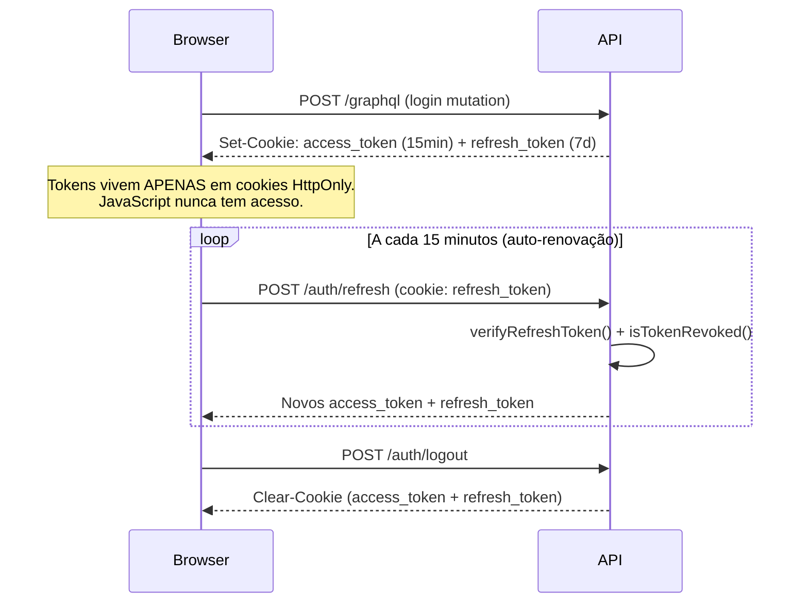
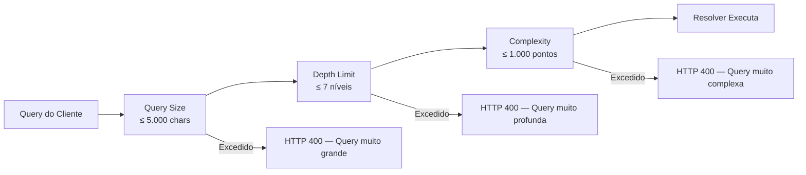

# Segurança e Conformidade

A segurança dos dados médicos e a privacidade dos pacientes são prioridades absolutas no CRMed. Esta página detalha cada camada de proteção implementada no sistema.

---

## 1. Autenticação — JWT + Cookie HttpOnly

O sistema utiliza uma estratégia de **duplo token** com ciclos de vida distintos para balancear segurança e usabilidade:

| Token | Duração | Armazenamento | Finalidade |
| :--- | :--- | :--- | :--- |
| `access_token` | **15 minutos** | Cookie `HttpOnly; SameSite=Strict; Secure` | Autoriza chamadas à API GraphQL |
| `refresh_token` | **7 dias** | Cookie `HttpOnly; path=/auth/refresh` | Renova o access token sem novo login |

### Fluxo de Tokens



### Revogação de Tokens (Token Blacklist)

Quando um usuário é desativado por um Admin, todos os seus tokens são imediatamente invalidados, mesmo que ainda estejam dentro do prazo de validade:

```
Redis Key: token_blacklist:{userId}
TTL: 7 dias (equivalente ao refresh_token)

Verificação a cada request:
  isTokenRevoked(userId) → Redis.get(key) !== null
```

Em produção, falhas de conexão com Redis resultam em **deny by default** (fail closed), impedindo que tokens de usuários desativados sejam aceitos.

### Hash de Senhas

Senhas são armazenadas com **bcryptjs** usando **12 rounds** de salt (acima do mínimo recomendado de 10), tornando ataques de força bruta computacionalmente inviáveis.

---

## 2. Rate Limiting (Distribuído via Redis)

Três camadas independentes de Rate Limit protegem a API contra abuso e ataques de força bruta. Os contadores são persistidos no **Redis**, garantindo que os limites sejam respeitados mesmo após reinicializações do servidor. Em produção, a API utiliza o header `X-Forwarded-For` para identificar o IP real do cliente através do load balancer (configurado via `app.set('trust proxy', 1)`).

| Limiter | Janela | Limite | Aplica-se a |
| :--- | :--- | :--- | :--- |
| `apiLimiter` | 1 minuto | **100 req/IP** | Todas as rotas (`/graphql`, `/api/*`) |
| `mutationLimiter` | 1 minuto | **20 mutations/IP** | Apenas operações GraphQL `mutation` |
| `loginLimiter` | 15 minutos | **10 tentativas/IP** | `POST /auth/refresh` |

Quando o limite é excedido, a API retorna `HTTP 429` com formato compatível com erros GraphQL:

```json
{
  "errors": [{
    "message": "Muitas requisições deste IP, por favor tente novamente mais tarde",
    "extensions": { "code": "RATE_LIMITED" }
  }]
}
```

> **Desenvolvimento:** Rate limits são automaticamente ignorados para requisições de `localhost` (`127.0.0.1` / `::1`) para não bloquear o fluxo de desenvolvimento.

---

## 3. Proteção contra XSS e Injeções

### XSS — Cross-Site Scripting

| Proteção | Mecanismo | Descrição |
| :--- | :--- | :--- |
| **Cookies HttpOnly** | `Set-Cookie: HttpOnly` | Tokens inacessíveis ao JavaScript da página. Mesmo que XSS ocorra, o atacante não consegue roubar sessões. |
| **Content Security Policy** | `helmet()` middleware | Em produção, o Helmet configura headers CSP, `X-Frame-Options`, `X-XSS-Protection` e outros headers defensivos. |
| **SameSite=Strict** | Cookie flag | Bloqueia o envio de cookies em requisições cross-site, protegendo contra CSRF. |
| **CORS restrito** | Lista de allowedOrigins | Em produção, apenas origens explicitamente autorizadas em `CORS_ORIGIN` são aceitas. Origens não autorizadas são logadas e bloqueadas. |

### SQL Injection

- **Prisma ORM** utiliza prepared statements parametrizados para todas as queries, eliminando SQL Injection por design.
- **`validateEnum()`** no RBAC valida todos os inputs de enum do cliente no servidor antes de qualquer operação no banco.

---

## 4. Segurança GraphQL (OWASP API Security)

O Apollo Server possui três plugins de segurança customizados que protegem contra ataques específicos de APIs GraphQL:



| Plugin | Limite | Ataque Mitigado |
| :--- | :--- | :--- |
| **Query Size Limit** | 5.000 caracteres | Envio de payloads maliciosos e queries enormes |
| **Depth Limit** | 7 níveis de aninhamento | *Deeply Nested Queries* — DoS por recursão |
| **Complexity Analysis** | 1.000 pontos de custo | *Batching attacks* — queries que custam N×M operações no banco |

Campos que geram queries pesadas no banco (`leads`, `patients`, `appointments`, etc.) têm custo de **10 pontos** e multiplicam o custo de seus filhos por **5x**.

### Introspection

A introspection do schema GraphQL está **desabilitada em produção**, impedindo que atacantes mapeiem a API automaticamente.

---

## 5. Modelo RBAC (Role-Based Access Control)

O sistema utiliza roles para controlar o acesso a funcionalidades e dados (conforme **RN03**). A verificação é centralizada em `apps/api/src/config/rbac.ts` via helpers tipados.

| Role | Permissões |
| :--- | :--- |
| **ADMIN** | Acesso total: configurações, usuários, exportação de dados, prontuários. |
| **SURGEON** | Prontuários médicos, agenda própria e resultados de exames do próprio paciente. |
| **RECEPTION** | Gestão de agendamentos, check-in de pacientes e visualização de agenda geral. |
| **CALL_CENTER** | Gestão de leads e contatos. Dados sensíveis de pacientes são mascarados (RN07). |
| **SALES** | Gestão de orçamentos e conversão de leads. |

### Padrão de Verificação nos Resolvers

```typescript
// 1. Garante que há usuário autenticado
assertAuthenticated(context);

// 2. Verifica se o role tem permissão para a ação
assertRole(context, ['ADMIN', 'SURGEON'], 'visualizar prontuário');

// 3. Para mudanças de status críticos, registra no AuditLog (RN06)
await enforceStatusChange({
  context,
  entityType: 'Appointment',
  entityId: id,
  oldStatus, newStatus,
  blockedRoles: ['CALL_CENTER', 'SALES'],
  criticalStatuses: ['COMPLETED', 'NO_SHOW'],
});
```

---

## 6. Conformidade com LGPD

| Requisito | Implementação |
| :--- | :--- |
| **Minimização de Dados (RN07)** | CALL_CENTER visualiza CPF mascarado (últimos 3 dígitos) e telefone parcialmente oculto. |
| **Audit Log (RN06)** | Toda alteração de status, deleção ou acesso a dado sensível gera registro no `AuditLog` com `userId`, `ip`, `oldValue`, `newValue` e timestamp. |
| **Soft Delete** | `Lead` e `Patient` usam `deletedAt` em vez de hard-delete, preservando integridade histórica e permitindo recuperação. |
| **Direito ao Esquecimento** | O sistema suporta deleção lógica e física de dados mediante solicitação formal. |
| **Consentimento** | O fluxo de onboarding via WhatsApp inclui desafio LGPD (`VERIFY_DOB_CHALLENGE`) antes de exibir dados de agendamentos. |

---

## 7. Segurança de Uploads de Arquivos

O endpoint `POST /api/upload` implementa múltiplas camadas de validação:

- **Autenticação obrigatória**: Middleware `requireAuth` bloqueia uploads sem sessão válida.
- **MIME Type Allowlist**: Apenas `image/jpeg`, `image/png`, `image/webp`, `application/pdf`, `text/csv` e documentos Office são aceitos.
- **Limite de tamanho**: Máximo de **10 MB** por arquivo.
- **Path Traversal**: O servidor valida que o nome do arquivo não contém `..` ou `/`, impedindo acesso a diretórios fora de `uploads/`.
- **Acesso protegido**: `GET /api/uploads/:filename` exige autenticação — documentos médicos não são públicos.

---

## 8. Segurança de Webhooks

A comunicação da Evolution Go com os Workers é protegida por duas camadas:

- **HMAC-SHA256**: Cada request de webhook possui assinatura criptográfica validada no servidor.
- **IP Allowlist**: Requisições fora do range autorizado da infraestrutura são bloqueadas antes de chegar ao handler.

---

## 9. Mapeamento OWASP Top 10 (2021)

| # | Categoria OWASP | Mitigação no CRMed |
| :--- | :--- | :--- |
| A01 | **Broken Access Control** | RBAC centralizado (`assertRole`), ADMIN-only para operações críticas, token revocation via Redis. |
| A02 | **Cryptographic Failures** | TLS 1.3 obrigatório, bcrypt 12 rounds, JWT HS256, cookies `Secure; HttpOnly`. |
| A03 | **Injection** | Prisma ORM (prepared statements), `validateEnum()` para inputs, sem concatenação de SQL. |
| A04 | **Insecure Design** | Soft Delete + Audit Log por design, LGPD como requisito, separação de roles no schema. |
| A05 | **Security Misconfiguration** | Helmet.js, CORS allowlist, introspection GraphQL desabilitada em prod, secrets via env vars. |
| A06 | **Vulnerable Components** | Dependências auditáveis via `pnpm audit`. Checklist de produção inclui scanning periódico (SonarQube/Snyk). |
| A07 | **Authentication Failures** | Rate Limit no login, cookies HttpOnly, token blacklist, senha nunca exposta em resolvers. |
| A08 | **Software & Data Integrity** | HMAC-SHA256 em webhooks, `INTERNAL_API_KEY` para comunicação interna Workers→API. |
| A09 | **Security Logging & Monitoring** | Logger estruturado em todos os eventos de auth, RBAC e rate limit. AuditLog no banco. |
| A10 | **SSRF** | Workers consomem apenas a URL da Evolution Go configurada via env var. Sem URLs dinâmicas do cliente. |

---

## 10. Checklist de Produção

- <input type="checkbox" class="task-list-item-checkbox" /> Ativar WAF (Web Application Firewall) na borda (ex: AWS WAF / Cloudflare).
- <input type="checkbox" class="task-list-item-checkbox" /> Usar Secrets Manager (AWS Secrets Manager) para `JWT_SECRET`, `REFRESH_SECRET`, `INTERNAL_API_KEY`.
- <input type="checkbox" class="task-list-item-checkbox" /> IAM Least Privilege para serviços (S3, RDS, Redis).
- <input type="checkbox" class="task-list-item-checkbox" /> Habilitar TLS 1.3 no load balancer e desabilitar TLS 1.0/1.1.
- <input type="checkbox" class="task-list-item-checkbox" /> Configurar `CORS_ORIGIN` com apenas os domínios de produção.
- <input type="checkbox" class="task-list-item-checkbox" /> Scanning de vulnerabilidades periódico (SonarQube / Snyk).
- <input type="checkbox" class="task-list-item-checkbox" /> Configurar alertas de Rate Limit no sistema de monitoramento (Datadog / CloudWatch).
- <input type="checkbox" class="task-list-item-checkbox" /> Revisar `DEV_ALLOWED_PHONE` — garantir que está vazio ou não definido em produção.
